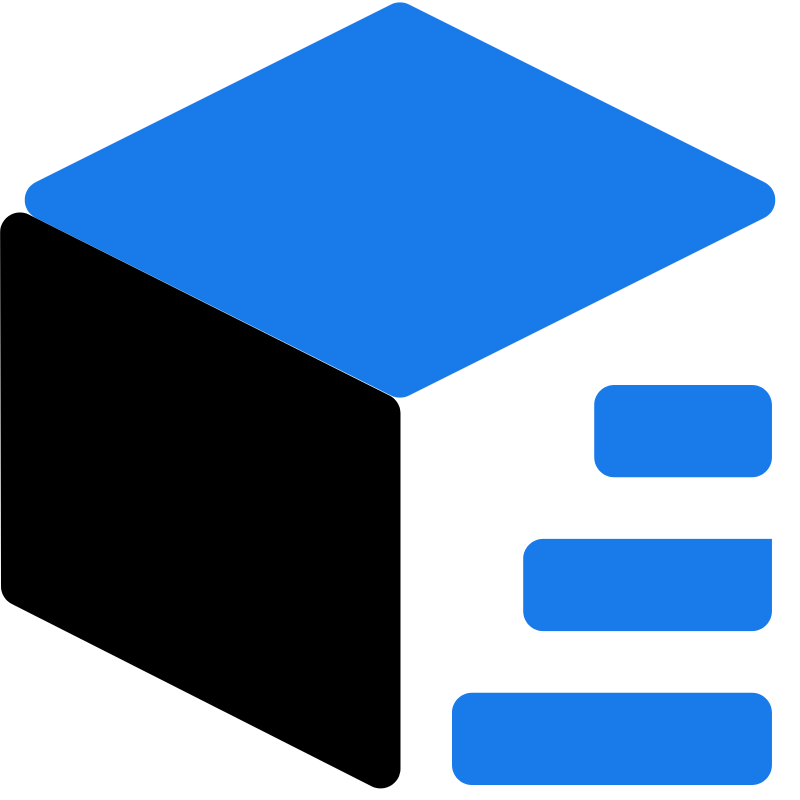

<p align="center">
  
</p>

<p align="center">Comic Plus | 一个vue3 + ts的UI框架</p>

<p align="center">
 
 
 
 
 
</p>

## 安装教程

```shell
npm install comic-plus

# 指定版本
npm install comic-plus@version
```

## 使用说明

```JavaScript
//建议前往官网查看详细使用方式

//完整引入
import { createApp } from 'vue';
import ComicPlus from 'comic-plus';
import 'comic-plus/theme/index.css'; //导入全局css

const app = createApp(App);
app.use(ComicPlus)

app.mount('#app')

//按需引入
//main.js | main.ts
import 'comic-plus/theme/index.css';

//pages
import { /* 组件名 */ } from 'comic-plus';

```

## 组件库官网

<a href="http://comicui.cn">http://comicui.cn</a>

## 组件库使用示例

<a href="http://comicui.cn/admin">http://comicui.cn/admin</a>

## 参与贡献

<p>
  <a href="https://github.com/qq2993496157" align="center">
    
  </a>
</p>

#### 征集

<font size="2">
  需要一个可以帮我重新设计组件样式配色的UI，项目无偿，但会在开发人员处添加你的署名，并将你的名片挂在该站。
</font>
